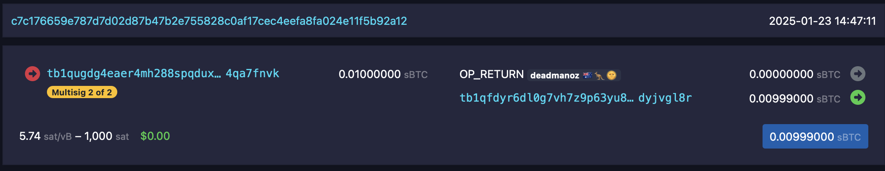

# Signet Wallet Challenge

There were 2 parts to this work, (1) was focused on "recovering" a wallet from a provided private key and (2) was about creating spends from the wallet using different transaction types. I didn't set out to write so much, but there was a lot of ground to cover and learning to be done.

We were required to work against a signet Bitcoin network that had been setup specifically for the BOSS 2025 program. To lock in a known state for evaluation purposes, a certain block was invalidated with `invalidateblock`, rendering all following blocks to also be invalid. Why do I mention this? I found the use of it in one of the setup scripts, ran the script locally and subsequently forgot about it. Sometime later, when I was working on the second part of the challenge, I encountered invalid TXIDs that I knew to be valid.. took me a while to realise it why!

## Wallet recovery
This was the easier of the two parts. I was both anxious to get stuck in and also not confident in my fledgling Rust skillz so I did the initial implementation in Python. Once I had a working implementation, I re-implemented in Rust as I had a template I understood to work from.

One challenging aspect was the correct derivation of a child private key from a parent private key, but the implementation details are spelled out pretty explicitly in the [BIP (BIP32)](https://github.com/bitcoin/bips/blob/master/bip-0032.mediawiki).

The other issue I saw crop up quite frequently was rounding and precision issues. The `bitcoin-cli` returns values as floating point rather than satoshis ("sats"), so you have to ensure that you correctly extract the sats from the floating point value. You also need to ensure that "Satoshi precision" is preserved in all calculations.

It's worth noting that in a lot of writing about Bitcoin Script, `OP_PUSHBYTES_X` data push opcodes are often implied when data is being pushed to the stack. This is definitely a gotcha that can trip you up if you're new to Bitcoin Script. For example, if we have a 20-byte hash being produced by `HASH160(pub-key)`, we need to ensure to add `OP_PUSHBYTES_20` to the script before pub-key hash.

## Transaction construction & spending
This was, both for myself and seemingly for most, the most challenging part of the challenge. I honestly got hung up on *something* in the transaction construction/signing process for about a week with the dreaded `mandatory-script-verify-flag-failed (Signature must be zero for failed CHECK(MULTI)SIG operation)` error. Even afterwards, I'm not sure what it was that I was doing wrong - my solution was to blow everything away and start afresh. I didn't even save the original code to avoid remaking the same mistake. This was also the first challenge or part thereof that I did in Rust only, no Python.

It's useful to know or remember that the witness field data is not Script. So unlike `scriptSig` for a P2PKH output, which involves the aforementioned (often implied) data push opcodes such as `OP_PUSHBYTES_20`, the witness items for a P2WPKH output involve `CompactSize` sizes that represent the size in bytes of the signature and the pubkey.

The top 2 resources I list on the [useful resources](../useful-resources.md), [Learn me a Bitcoin (LMAB)](https://learnmeabitcoin.com/) and [Decoding Bitcoin](https://bitcoindevs.xyz/decoding/), have awesome visualisations that helped grok lots about this challenge.

Some other resources that were useful for understanding and completing this task:
- https://medium.com/coinmonks/creating-and-signing-a-segwit-transaction-from-scratch-ec98577b526a
- https://github.com/chaincodelabs/bitcoin-tx-tutorial

And of course the relevant BIPs:
- [BIP143 - Transaction Signature Verification for Version 0 Witness Program](https://github.com/bitcoin/bips/blob/master/bip-0143.mediawiki)
- [BIP141 - Segregated Witness (Consensus layer)](https://github.com/bitcoin/bips/blob/master/bip-0141.mediawiki)
> TIP: check the endianness of TXIDs you're working with, what is returned by `bitcoin-cli` may need to be modified. I noticed that lots of people got stuck on this.

## Proof-of-solution

# Learnings
Lots of learnings from doing this challenge...

## Learning - get a clear understanding of the terminology
I kept on getting confused by terminology relating to authorisation and authentication, particularly with the introduction of new terms with Segwit. I think I've now got a handle on this all, so here goes..

First here's a modified reproduction of `Table 6.1 - Terms used for authorization and authentication data in different parts of Bitcoin` from [Mastering Bitcoin 3rd Ed](https://github.com/bitcoinbook/bitcoinbook/blob/275c4eb8eab8800c6adc39f8def8e8f8fa356a57/ch06_transactions.adoc#segregated-witness). I've added some extra rows to help clarify.

|                     | Authorization   | Authentication     |
| ----------          | -------------   | --------------     |
| Concept             | Locking script  | Unlocking script   |
| Whitepaper          | Public key      | Signature          |
| Original (legacy)   | Output script   | Input script       |
| Legacy transactions | scriptPubKey    | scriptSig          |
| Segwit              | Witness program | Witness structure  |

There's also a few other terms you'll come across:
- Witness
- Witness field
- Witness script
- Script witness
- Script code

`scriptSig` and `scriptPubKey` are fields you'll come across in data returned by `bitcoin-cli` when querying block and transaction data. I don't think there is much ambiguity in the terminology of these; `scriptPubKey` is the "locking" script you'll find on transaction outputs, `scriptSig` is the "unlocking" script you'll find on transaction inputs. More specifically, the `scriptSig` is used to satisfy the conditions set by the `scriptPubKey` for legacy transactions.

Although these fields are always present, the `scriptSig` field is no longer used when satisfying the conditions set by the `scriptPubKey` field for Segwit transactions. Data in the `witness` is used for this purpose.

`witness` is also fairly unambiguous, it's the region in a Segwit transaction that contains the data required to unlock Segwit inputs. As an example, a spend of a *single* P2WPKH output in a Segwit transaction would have a `witness` that contains a single `witness field`/`script witness` (for the single transaction input) with:
1) Number of items in the witness (always 2 for this single input P2WPKH scenario)
2) Item 1: Signature prefixed by size.
3) Item 2: Pubkey prefixed by size.

Actually, Greg Walker has created an excellent page on everything `witness` on [LMAB: Witness - unlocking code (for segwit inputs)](https://learnmeabitcoin.com/technical/transaction/witness/).

A `witness script` then is the actual script that defines the spending conditions in a Segwit transaction. Depending on the transaction type, it's either implied/*"doesn't really exist"* (is reconstructed by nodes during verification) in the case of P2WPKH, or is explicit, as in the case of P2WSH.

The `script code` is essentially the same as the `witness script` in terms of information, at least for P2WSH, where the `witness script` becomes the `script code` during signature verification.

However, as noted above, there's actually no `witness script` for P2WPKH as it's reconstructed during verification when the P2WPKH transaction type is detected. For P2WPKH the `script code` is `76a914{20-byte-pubkey-hash}88ac`/`OP_DUP OP_HASH160 OP_PUSHBYTES_20 <20-byte-pubkey-hash> OP_EQUALVERIFY OP_CHECKSIG`.

Got all that? Phew. Maybe one day I'll touch upon the overloaded term that redeem script also appears to be!!

## Learning - RTFM (again), don't take shortcuts (again)
A particular "skill" I developed over the course of my career to this point was to rapidly find the information I need to achieve something, use it and move on. In some contexts such as a startup trying to get something to market or achieve product market fit, this is certainly a useful skill to be able to draw on. But use it too much and it becomes the defacto way of achieving things.

## Learning - the details matter
I guess this goes without saying, every little detail matters, you make one small mistake and *"no bueno"* something is going to be broken. I guess this contrasts to other contexts where you can get away with not paying attention to the details, make mistakes and potentially get away with it. But not in Bitcoin land. This can be somewhat frustrating initially but I've found it to be deeply refreshing; patience and attention to detail are the only way forward!

## Learning - understanding cryptography is non-negotiable
I guess there is a reason why Jimmy Song introduces the cryptography in the first few chapters of [Programming Bitcoin](https://github.com/jimmysong/programmingbitcoin) in the way he does - it is foundational material to understand if you're going to be working with Bitcoin. I also found that he had positive framing for the material, that is, maybe all you need is to readjust your mental model of the math involved, it's not as scary as it first seems.

I made an aborted attempt at implementing ECDSA for the transaction construction and spending (signing) component during my "week in the wilderness" and came to appreciate that I need to both (a) specifically successfully reimplement ECDSA at some point purely to solidify my understanding and (b) more generally develop a deeper understanding of all the cryptography in Bitcoin as it's fundamental and pervasive. All roads in Bitcoin land lead to cryptography.
