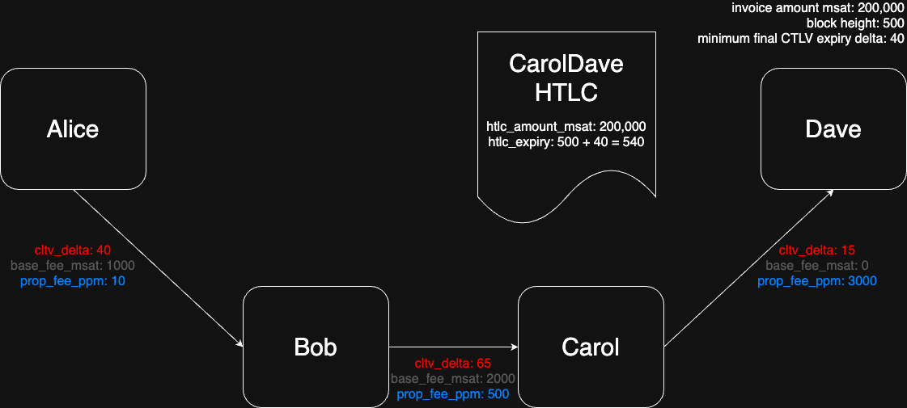
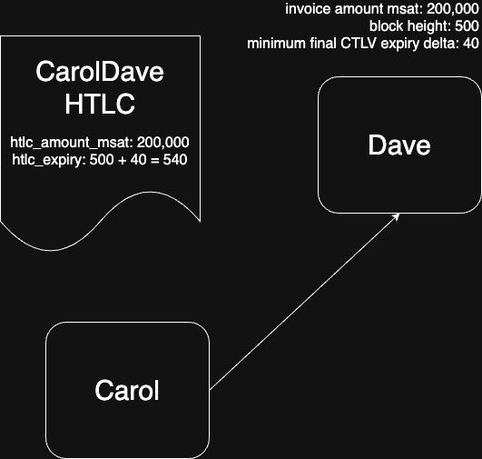
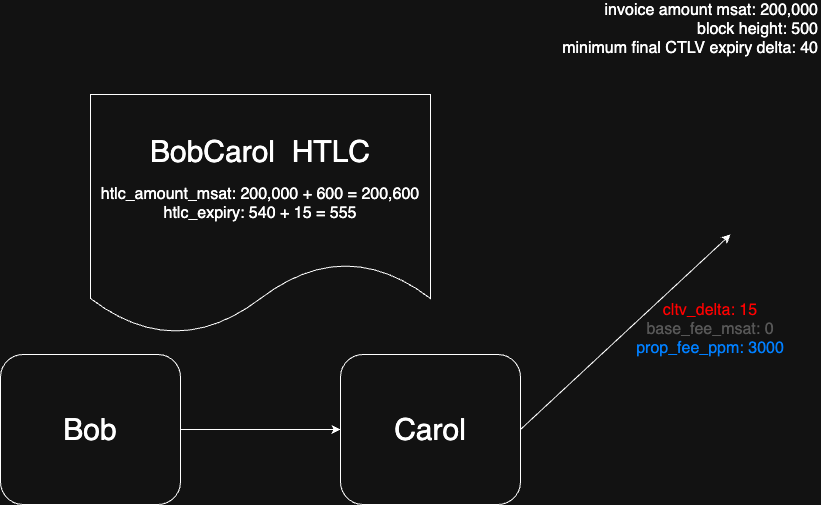
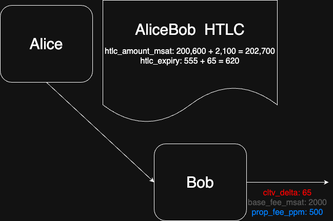

# Lightning Route Builder

This challenge was all about understanding HTLCs, fees and expiries, routing (simple and MPP) and TLVs. Not going to lie, conceptually this was maybe most difficult of the challenges so far, probably because I only had a surface-level understanding of Lightning. Once I grokked the contents, the implementation was relatively straightforward. 

One aspect that tripped me up was the relationship between channels, nodes and hops and which values of `cltv_delta` and the fees (`base_fee_msat`, `proportional_fee_ppm`) applied where. So here's a visual representation based on the example data (changed slightly so as to not give away the solution).

We have `Alice` wishing to pay an invoice from `Dave` and have a simple 3-hop path selected. We want to construct the HTLCs for each hop in the route. To do this we need to work backwards from the recipient to the sender.

The final node in the route is `Dave` and we have `cltv_delta` and fees (`base_fee_msat`, `proportional_fee_ppm`) for the last hop in the route (`CarolDave`). Jumping straight into the HTLC details:
- **The amount (e.g. `htlc_amount_msat`) for the HTLC for this final hop is just the invoice amount.**
- **The expiry (`htlc_expiry`) for the HTLC for the final hop is just the summation of the block height and the minimum final CLTV delta.**

At the risk of being too explicit:
- The `CarolDave` channel fees are irrelevant to the final hop!
- The `CarolDave` `cltv_delta` is also irrelevant to the final hop!
- The recipient of this HTLC is `Dave`, not `Carol`.
- *The `CarolDave` channel requirements are relevant to upstream HTLCs and nodes.*

Moving back towards the sender and determining the `BobCarol` hop HTLC. The recipient of this HTLC is `Carol`, so it must meet *her* requirements, not `Bob`'s. So:
- The `htlc_amount_msat` is the sum of the previous hop's `htlc_amount_msat` and `Carol`s fees. I've omitted the explicit working to arrive at `600` for the fee increment, the formula is straightforward.
- The `htlc_expiry` is the sum of the previous hop's `htlc_expiry` and `Carol`'s `cltv_delta`.

Moving back to arrive at the sender `Alice` and determining the `AliceBob` hop HTLC. Again, the recipient of this HTLC is `Bob`, so it must meet *his* requirements, not `Alice`'s. So:
- The `htlc_amount_msat` is the sum of the previous hop's `htlc_amount_msat` and `Bob`'s fees.  
- The `htlc_expiry` is the sum of the previous hop's `htlc_expiry` and `Bob`'s `cltv_delta`.

Note that this is the last hop in the route - we've arrived at the sender, `Alice`, have constructed 3 HTLCs, yet none of these HTLCs use information from the `AliceBob` channel. This makes sense conceptually, although it's used in the route, why should `Alice` pay channel fees to use her own channel `AliceBob`?

And that's it! We've constructed a route from `Alice` to `Dave` using the `AliceBob`, `BobCarol` and `CarolDave` channels, and constructed the HTLCs for each hop by working backwards from the recipient to the sender. The key thing to keep in mind is who is the recipient of each HTLC, and thus who's requirements must be encapsulated in each HTLC.
