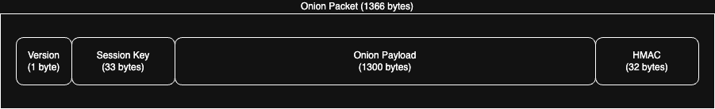
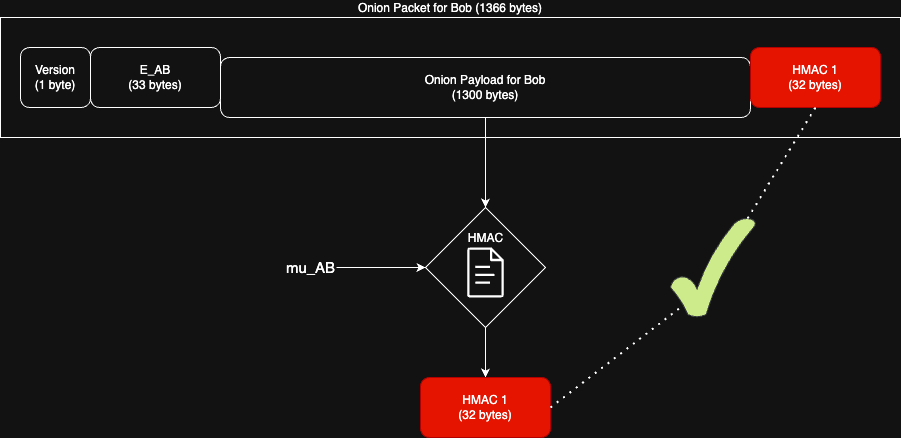
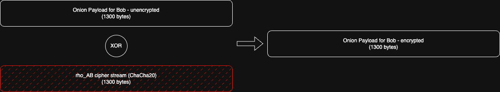
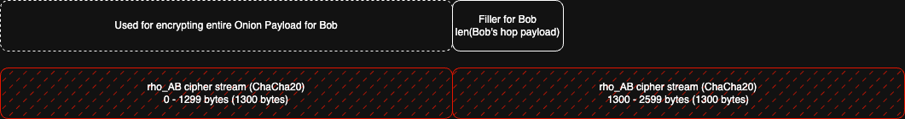
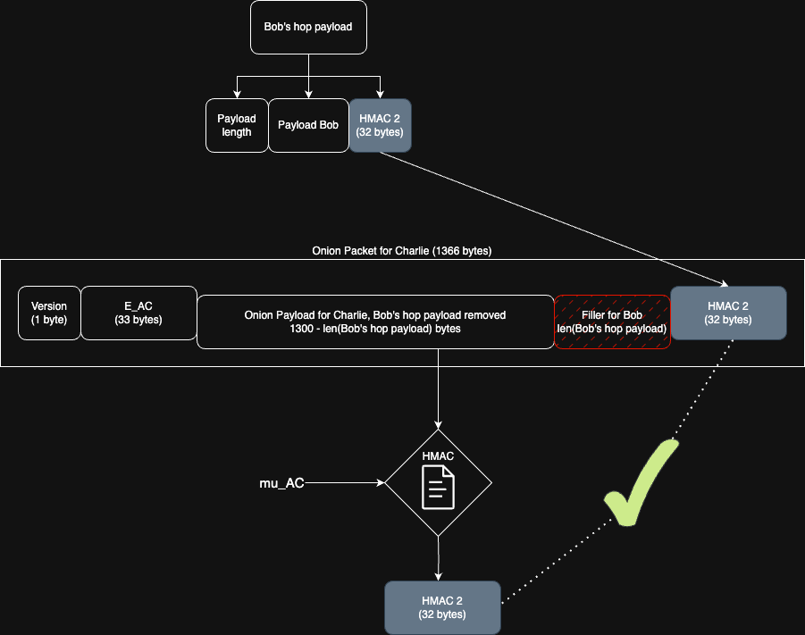

# Lightning Onion Builder

**_NOTE: this is still a work in progress, it's much harder to communicate than I initially thought and IMO the current illustrations are not as clear as they could be!_**

Fittingly enough, being the last "coursework" challenge, this one was probably the most difficult of the challenges thus far. The goal was to implement the construction of Lightning network onion packets given a list of hops, including hop/node pubkeys and payloads.

The difficulties in this challenge lay in a few areas:
- The need to familiarise yourself with [BOLT #4 - Onion Routing](https://github.com/lightning/bolts/blob/master/.04-onion-routing.md)
- BOLT #4 being somewhat out-of-date - the specification refers to legacy payloads (which had a fixed size) and has not yet been updated since the move to TLV (type-length-value) encoded payloads.
- BOLT #4 code samples being written in Go, a language I have little familiarity with.
- There are a lot of index calculations and byte shifting operations, it's easy to get lost in the weeds.
- The use of deterministic CSPRNG (Cryptographically Secure Pseudorandom Number Generator) and the strict alignment of application via XOR, using different keys and positions/sizes for each hop is a bit tricky to get right.

The last point is referring to the "filler" which is what I observed most participants commenting on, and which will be the primary focus of this writeup.

In the following I use the term onion payload to refer to the encrypted payload of the onion packet. An onion packet also has `version`, `session_key` and `hmac` (checksum) fields.



## Resources
The challenge instructions are relatively brief but point to 2 excellent resources:
- [Christian Decker - Onion Deep Dive](https://www.youtube.com/watch?v=D4kX0gR-H0Y)
- [Elle Mouton - Sphinx Packet Construction](https://ellemouton.com/posts/sphinx/)

Voltage also has a very short video on [Wrapping the Onion Layers](https://www.youtube.com/watch?v=FzedRXqZDyY). And of course the Mastering the Lightning Network book has a chapter on [Onion Routing (Chapter 10)](https://github.com/lnbook/lnbook/blob/develop/10_onion_routing.asciidoc) - it's maybe a little light on some of the more subtle details, but still a good reference.

In addition to these, it is worth remembering that there are multiple Open Source implementations of Lightning nodes that must necessarily implement onion packet construction and routing to participate in the Lightning network!
- [LND's Lightning Onion (Go)](https://github.com/lightningnetwork/lightning-onion)
- [C-Lightning (C)](https://github.com/ElementsProject/lightning/blob/master/common/sphinx.c)
- [Eclair (Scala)](https://github.com/ACINQ/eclair/blob/master/eclair-core/src/main/scala/fr/acinq/eclair/wire/protocol/OnionRouting.scala)
- [LDK's Rust Lightning (Go)](https://github.com/lightningdevkit/rust-lightning/blob/main/lightning/src/ln/onion_utils.rs)
- [Electrum (Python)](https://github.com/spesmilo/electrum/blob/master/lib/onion.py)

Here's some other material that might be of use:
- [What is Onion Routing. How does it work? (Voltage)](https://www.voltage.cloud/blog/what-is-onion-routing-how-does-it-work)
- [Peeling the Onion (Fanis Michalakis)](https://fanismichalakis.fr/posts/peeling-the-onion/)

## The filler (& padding)
Elle Mouton's [post](https://ellemouton.com/posts/sphinx/) does a great job of explaining why the filler has a very specific structure by first walking through the construction of the onion packet with just "padding" without the filler. It's worth remembering that the padding and filler are essentially to obfuscate details of the route from intermediate nodes - each node only knows something about the node it receives the packet from and the node it's sending the packet to, doesn't know it's position in the route etc.

### Initial padding
The initial padding is easy enough to create, it's just "random" data to initialise the onion payload. This random data is actually a pseudo-random byte stream which the BOLT #4 spec has something to say about [Pseudo Random Byte Stream](https://github.com/lightning/bolts/blob/master/04-onion-routing.md#pseudo-random-byte-stream):

> _The pseudo-random byte stream is used to obfuscate the packet at each hop of the path, so that each hop may only recover the address and HMAC of the next hop. The pseudo-random byte stream is generated by encrypting (using ChaCha20) a 0x00-byte stream, of the required length, which is initialized with a key derived from the shared secret and a 96-bit zero-nonce (0x000000000000000000000000)._
>
> _The use of a fixed nonce is safe, since the keys are never reused._

With the onion payload being 1300 bytes, we use ChaCha20 with a fixed nonce to generate a 1300 byte stream. The BOLT #4 spec also mentions the following about this [Pseudo-random stream (Conventions)](https://github.com/lightning/bolts/blob/master/04-onion-routing.md#conventions):

> _Pseudo-random stream: ChaCha20 is used to generate a pseudo-random byte stream. For its generation, a fixed 96-bit null-nonce (0x000000000000000000000000) is used, along with a key derived from a shared secret and with a 0x00-byte stream of the desired output size as the message._

So to generate the padding we need:
- The `session_key`, to generate the `pad` key
- A deterministic CSPRNG to generate the random byte stream given the `pad` key - ChaCha20 with a fixed nonce
- A 0x00-byte stream of the desired output size as the message - 1300 bytes of 0x00

It might look something like this in Rust:
```Rust
let nonce = [0u8; 12]; // 96-bit null-nonce
let mut onion_payload_init = [0u8; ONION_PAYLOAD_LENGTH];
let mut cipher = ChaCha20::new(pad_key, &nonce.into());

cipher.apply_keystream(&mut onion_payload_init);
```

### Multiple iterations to generate the filler
Now onto the filler itself. The filler has a very specific structure due to the need for the onion packet to be unwrapped and re-wrapped by each hop/node in the path. And for the HMAC result as computed by each node to match the HMAC encoded into the payload by the original sender.

Before you proceed, please again checkout [Elle Mouton's excellent post](https://ellemouton.com/posts/sphinx/#second-attempt-at-wrapping-the-onion) as the following is really intended to be just a different twist on what she has written.

The creation of the filler is an iterative process, where each iteration generates a byte array which is the result of XORing the previous iteration's byte array (which has been extended by the size of the payload) with a cipher stream generated from the shared secret-derived `rho` key.

We can first determine what the size of the filler should be, by determining the length of all but the first hops payloads. Now the term `payload` is a bit loaded here because we have:
- `payload for hop` - this is the actual data intended for the node/hop.
- `hop payload` - this has 3 components, one of which is the `payload for hop`, another being the BigSize encoded length of the `payload for hop`, and the third being the HMAC of the onion payload (32 bytes).

```Rust
let all_hops_payload_length = hops.iter().map(|hop| hop.payload.len()).sum();
let filler_length = all_hops_payload_length - hops[0].payload.len();
```

Let's follow in the footsteps of Elle Mouton and have a sender, `Alice`, with `Bob` & `Charlie` being the intermediate nodes and `Dave` being the final recipient. Again, the purpose of the filler is to ensure that
the HMACs that are computed by each node match the HMACs that are encoded into the onion payload by the original sender.



Note that in other parts of onion packet construction we are working inside out/last hop first, but for the filler we are working outside in/starting with the first hop, so we will start with `Bob`. `Bob` is going to be removing `len(payload for Bob)` bytes from the onion payload that he will need to replace before he can send on to `Charlie`. The data he uses, well `Alice` needs to have already generated it from the outset because she will have had to have computed the HMAC, `HMAC 2`, for the entire onion payload that `Bob` will be sending on.

`Alice` and `Bob` already have a means to generate the same data - derived keys from their shared secret, and the `rho` key in particular (`rho_AB`), is used to generate the pseudo-random stream for the filler. For this first hop, we use the bytes from position `1300` to `1300 - len(payload for Bob) - 1` (- 1 because of 0 indexing) from the pseudo-random stream for `Bob`'s filler component. It's worth noting that these particular bytes are used because the `0` to `1299` bytes are used to encrypt the entire onion payload for `Bob` as below.



At this stage the filler is just `len(payload for Bob)` bytes long, entirely obtained from the pseudo-random stream generated by `rho_AB` (using ChaCha20 with a 0x00-byte stream).



Note that we actually need >1300 bytes of a pseudo-random stream to be able to encrypt the onion payload and generate filler contributions. In practice, it's probably easiest to generate a pseudo random byte stream of length of 2600 for each hop (except the final hop) to make the index calculations nice and simple.



Moving onto `Charlie` and the situation is much the same as for `Bob`, `Charlie` is going to be removing `len(payload for Charlie)` bytes from the onion payload that he will need to replace before he can send on to `Dave`. Alice again will have needed to have generated this data in her original construction to correctly compute the HMAC (`HMAC 3`) for the entire onion payload that `Charlie` will be sending on.

Just like as for `Bob`, but using different indices to account for the fact that `len(payload for Charlie)` is likely to be different from `len(payload for Bob)`, `Alice` can use the `rho_AC` key to generate the pseudo-random stream for the filler. We use the bytes from position `1300` to `1300 - len(payload for Charlie) - 1` from the pseudo-random stream for `Charlie`'s filler component to replace the `len(payload for Charlie)` bytes that `Charlie` will be removing from the onion payload.

If we were to call it done here, that is, we appended this filler component from `Charlie` to what we generated for `Bob` and call that the filler, then we've missed a few things. Firstly, let's be clear that the filler does not actually make it into the final onion payload! It's used by `Alice` during onion packet construction to ensure that the HMAC's she computes during the process will match the HMAC's that are calculated by each hop over the onion payload they receive. Related to this, the filler is determined up-front at the start of the onion packet creation process, and it is only used in its entirety once, when `Alice` is creating the onion payload for the last hop `Dave` (we right shift the onion payload as we add each addition hop's payload, which effectively pushes the filler out of the payload).

The part we're missing is that when `Alice` is encrypting the onion payload for each hop, she's XORing with the appropriate pseudo-random stream to encrypt, with each hop similarly XORing with the same pseudo random stream, with the exact alignment, to decrypt upon receipt. This XOR by each hop will decrypt any bytes that were originally encrypted with the same pseudo-random stream by `Alice`, but it will only serve to further encrypt any bytes that were not originally encrypted with the same pseudo-random stream (there wont be any, but if there were any).

Here's the key sentence: `Bob`'s filler component is the last `len(payload for Bob)` bytes of `Charlies` onion payload, so it will be effectively encrypted by `Charlie`'s pseudo-random stream when `Charlie` is decrypting the onion payload. So `Bob`'s filler component should also be encrypted in this manner by `Alice` during onion packet construction!

This is easy enough to accomplish. When we're adding `Charlie`'s filler contribution, we simply ensure that `Bob`'s filler contribution is also encrypted with the same pseudo-random stream (`rho_AC`), but account for the fact that it would be `len(payload for Bob)` bytes into `Charlie`'s onion payload when it is initially decrypted (encrypted) by `Charlie`.

For this example were done; we've created the filler for the required 2 hops, `Bob` and `Charlie`, so we can now add this filler into the initial onion payload for `Dave` (the last `len(payload for Bob) + len(payload for Charlie)` bytes) and start the wrapping process (backwards from recipient). For a route with more hops, we'd simply repeat the above process, each time effectively shifting the previous hops filler contributions to the left and applying the pseudo-random stream via XOR to these contributions as well to 0x00 bytes the length of the current hop (`len(payload for hop)`) to finalise the current hop's filler contribution.

Anyway, at this point it might just be easier to explain the above with some demo code that shows how we can create the filler. Putting this into the initial onion payload, and wrapping for each hop is left as an exercise for the reader!

```Rust
let mut filler = vec![0u8; filler_length];
// For all hops but the last, calculate the required filler size and position
// Generate the cipher stream, and then XOR the filler with the cipher stream
for i in 0..hops.len() - 1 {
    let hop_rho = rho_for_hop(i);

    // We need to know how many bytes the previous hops have contributed to the filler
    let mut prev_hops_fill_size = 0;
    for j in 0..i {
        prev_hops_fill_size += hops[j].payload.len();
    }
    // The previous hops filler contributes are effectively left-shifted so that they end at
    // byte index ONION_PAYLOAD_LENGTH - 1 (1299)
    let filler_start = ONION_PAYLOAD_LENGTH - prev_hops_fill_size;
    // This hops filler starts at byte index ONION_PAYLOAD_LENGTH (1300)
    // and ends at 1300 + the size of the current hop payload
    let filler_end = ONION_PAYLOAD_LENGTH + hops[i].payload.len();

    // Generate the cipher stream (pseudo-random stream)
    let nonce = [0u8; 12]; // 96-bit null-nonce
    let mut cipher = ChaCha20::new(&hop_rho.into(), &nonce.into());
    // Use 2x 1300 to simplify the index calculations
    let mut cipher_stream = [0u8; ONION_PAYLOAD_LENGTH * 2];
    cipher.apply_keystream(&mut cipher_stream);

    // XOR the filler with the cipher stream
    // Note that this is applying the current hops pseudo-random stream populated
    // filler thus far. The current hops data is from byte index ONION_PAYLOAD_LENGTH (1300)
    // to filler_end and the previous hops data is from byte index filler_start to
    // ONION_PAYLOAD_LENGTH - 1 (1299)
    for i in filler_start..filler_end {
        filler[i-filler_start] ^= cipher_stream[i];
    }
}
```
