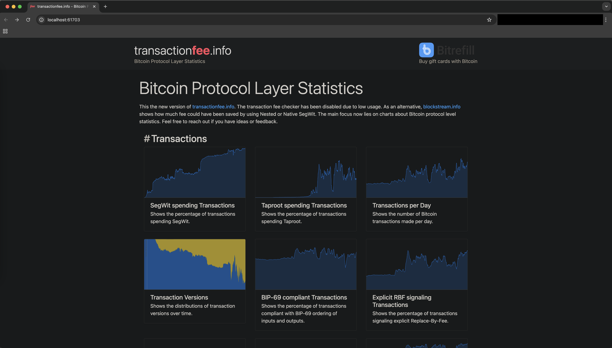
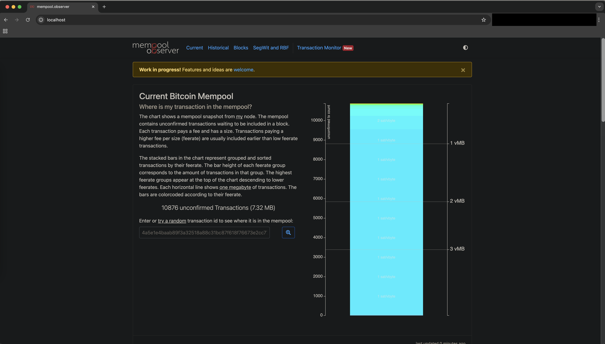

# 👋 0xB10C
0xB10C is a Bitcoin Developer who has an interest in Bitcoin data and monitoring the Bitcoin network. He's developed a number of public tools and services, the most notable being:
- [mempool.observer](https://mempool.observer/) - shows a mempool snapshot from his node. GitHub: https://github.com/0xB10C/memo
- [transactionfee.info](https://transactionfee.info/) - Bitcoin Protocol Layer Statistics. GitHub: https://github.com/0xB10C/transactionfee-info
- [miningpool.observer](https://miningpool.observer/) - "transparency for mining pool transaction selection". GitHub: https://github.com/0xB10C/miningpool-observer
- [fork.observer](https://fork.observer/) - "a fork of Bitcoin Core that is not a hard fork". GitHub: https://github.com/0xB10C/fork-observer

0xB10C is also one of the biggest proponents of USDT... not Tether, but [Userspace, Statically Defined Tracing](https://b10c.me/blog/008-bitcoin-core-usdt-support/) in Bitcoin Core. Not my joke, I heard it on [The Chaincode Podcast episode](https://podcast.chaincode.com/2022/06/06/timo-tracepoints-monitoring) 😂

I'm a very visual person, so I wanted to get some of his tools up and running locally so I could tinker with them. I document spinning up 2 of his projects, mempool.observer and transactionfee.info, below.

## transactionfee-info
I cloned the repo and worked to getting it up and running locally. There's currently no instructions on how to do this, so I set to work to understand what was required, spin it up locally and document the process. Being 2025 and all, and no shame in doing so, I leveraged an LLM (Claude Sonnet) to assist.

This project was my first use of [Nix](https://nixos.org) which seems like a neat tool for managing environments and dependencies. Aside: probably would like to experiment with NixOS next as it seems to be commonly used in the Bitcoin space also. After a few small changes to the `shell.nix` file and we're off to the races. 

```
# Enter the development environment
nix-shell
# Setup and start the backend
cd backend
# Run database migrations
diesel setup
diesel migration run
# This uses the default settings of connecting to localhost:8332
# creating a SQLite database in ./db.sqlite
# and writing the CSV files to ./csv
# See below for more details on the command-line arguments
cargo run --release
```

The backend needs to generate block stats from the genesis block right up to the current block height. This is (currently) a greedy CPU intensive operation so the process was frequently killed by the system. I ended up writing a [small patch](https://github.com/deadmanoz/transactionfee-info) to overcome this issue and ensure the process continued to completion. All up, it took a number of hours (maybe 5-10?) to generate the block stats. Block stats are stored in an SQLite database.

Once all block stats are generated (resulting in a SQLite database file of size ~380MB of all blocks to March 2025), the metrics generation kicks in, producing a whole bunch of CSV files that contain the data for the frontend to display. Actually, you can start the metrics generation process at any point, as long as some block stats have already been generated, by providing the `--no-stats` flag:

```
cargo run --release -- --no-stats
```

We can run the frontend to bring up the web server when we've got the CSV files generated. It will indicate what URL the web server is available at.

```
# Once in nix-shell..
cd frontend
hugo server -D
```



I opened a PR with my updates to the README/small changes to `shell.nix`: https://github.com/0xB10C/transactionfee-info/pull/33

## memo (mempool.observer)
This looks to be one of 0xB10C's older projects, probably pre-[mempool.space](https://mempool.space/), but it's still a neat tool nonetheless. It's a simple tool that shows a snapshot of the mempool from your node and some visualisations of mempool size, recent blocks and SegWit & RBF transaction statistics.

This was more challenging to get running locally because there are additional dependencies required: Redis and a web server. Solution: `docker-compose.yaml` with Redis and nginx. I've created a branch that documents the required setup so I won't repeat it all here: https://github.com/deadmanoz/memo/tree/self-hosting-setup

I noticed that the project only supported bitcoind authentication via `rpcuser` and `rpcpassword` so I created a PR to add support for cookie based authentication: https://github.com/0xB10C/memo/pull/111. 
> _"Maybe `rpcuser` and `rpcpassword` will be around forever, the deprecation warning has been around for ~9 years after all (bitcoin/bitcoin#29240), but how about also supporting cookieauth?"_

Anyway, with Redis, nginx, the memo API and the memo daemon all running, we now have our own local instance of mempool.observer:



I didn't yet modify the bitcoin node the memo daemon is running against to produce the `rawTx2` data for the "Bitcoin Transaction Monitor" page, so it's empty on my local instance. The `rawTx2` data is an additional ZMQ topic that adds fee and size information to the transaction data (what you get from the original `rawtx` topic). This requires the following patch: https://github.com/0xB10C/bitcoin/tree/2019-06-rawtx2-zmq-for-memod. 

## User-space, Statically Defined Tracing
https://github.com/bitcoin/bitcoin/blob/master/doc/tracing.md
https://github.com/bitcoin/bitcoin/blob/master/contrib/tracing/README.md

Unfortunately, as a macOS user, I didn't even attempt to explore the USDT features of Bitcoin Core yet. It's probably possible on Apple Silicon (https://medium.com/all-things-ebpf/when-mac-m1-m2-met-ebpf-a-tale-of-compatibility-6b9a6bc53f3e) but an easier path is probably to just use a Linux machine. I have on my [TODO list](../TODO.md) to get this sorted.
