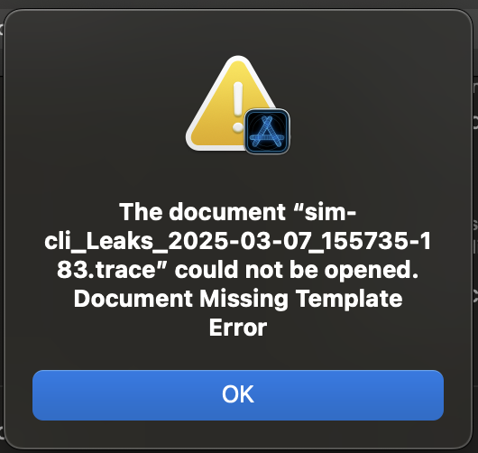
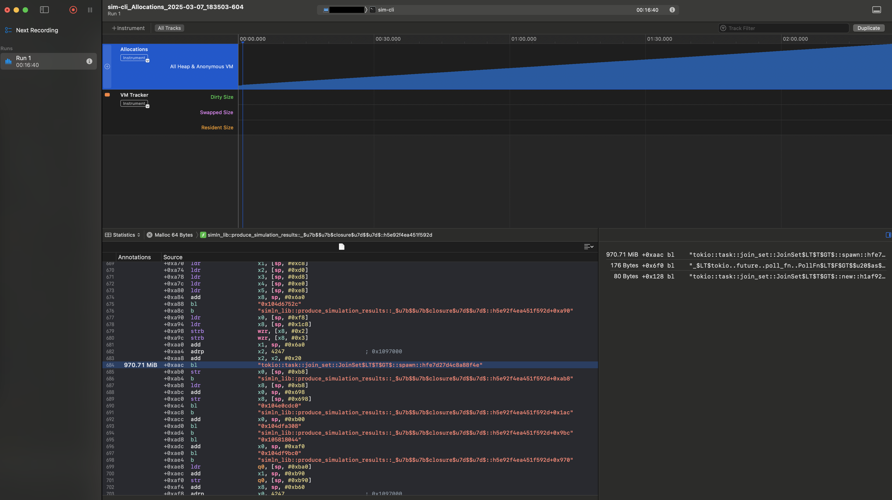

# 👋 SimLN

## SimLN background


## SimLN PR review
Checkout the relevant forks to get the branches locally:
- https://github.com/carlaKC/sim-ln/tree/clear-joinset
- https://github.com/carlaKC/sim-ln/tree/review-club-memleak

### \#221 - Prevent Memory Buildup by Clearing Joinsets
https://github.com/bitcoin-dev-project/sim-ln/pull/221

There's a specific branch to help illustrate the issue: https://github.com/carlaKC/sim-ln/tree/review-club-memleak.

We need to _"attach a heap allocation profiler and see the memory leak
in action, and identify the tasks that are building up memory."_

I'm on macOS so I'll need to use [cargo-instruments](https://github.com/cmyr/cargo-instruments) with XCode. Aside: It's been a long while since I've had to _myself_ run profilers and the like, going back maybe 6-7 years... the last time I had to use Windows! My most recent experience with such tools was been working with my previous engineering team using NVIDIA's NSys (Nsight Systems) for investigating issues and optimising video and machine learning processing pipelines.

```
cargo instruments --list-templates                             
Could not list templates. Please check your Xcode Instruments installation.
```

I have Xcode CLI tools already installed on macOS 14.7.1, but instruments doesn't appear to be available (supposed to be at `/usr/bin/instruments`). So I'll grab the main Xcode app - I'll need this to have a nice UI anyway.

Some reading material [Using Xcode Instruments for C++ CPU profiling](https://www.jviotti.com/2024/01/29/using-xcode-instruments-for-cpp-cpu-profiling.html).

Encountered an issue when a running, terminating (via ctrl-c) and then attempting to load the trace file in instruments. Thinking it might a template issue I tried both `alloc` and `Leaks` as below, but traces of neither could be loaded.

```bash
cargo instruments --bin sim-cli -t alloc -- -s simln.json
cargo instruments --bin sim-cli -t Leaks -- -s simln.json
```


Found a relevant issue on the cargo-instruments repo: https://github.com/cmyr/cargo-instruments/issues/41 and a comment provided the the solution: set a time limit, e.g. `--time-limit=N` (N in ms)
```bash
cargo instruments --bin sim-cli -t Leaks --time-limit 1000000 -- -s simln.json
```

Now we can create trace files that can be loaded into Instruments for analysis.

Here's a screenshot of the Instruments UI with one of the traces loaded (from `-t alloc` but it's similar for `-t Leaks`), showing the leak in `produce_simulation_results` relating to the `tokio::task::join_set`:



So what's going on?

`produce_simulation_results` is called from `run_data_collection`.

#### What are we simulating?
The `simln.json` file only contains a `sim_network`, no `nodes` or `activity`. So instead of explicitly specifying the nodes, the nodes in the network are inferred from the edges provided.

```
2025-03-07T14:07:25.973Z INFO  [simln_lib] Running the simulation forever.
2025-03-07T14:07:25.973Z INFO  [simln_lib] Simulation is running on regtest.
2025-03-07T14:07:25.973Z INFO  [simln_lib] Simulating 0 activity on 67 nodes.
2025-03-07T14:07:25.974Z INFO  [simln_lib] Summary of results will be reported every 60s.
2025-03-07T14:07:25.975Z INFO  [simln_lib] Created network generator: network graph view with: 67 channels.
```

As the comments above `new_with_sim_network` in `simln-lib/src/lib.rs` indicate, this is a
> "payment simulation that's running on a simulated set of channels. As this simulation has no underlying nodes it can optionally be sped up by some multiplying factor."

And when no activity description is specified by the user, as in this case, random activity is generated (`validate_activity` in `simln-lib/src/lib.rs`).
