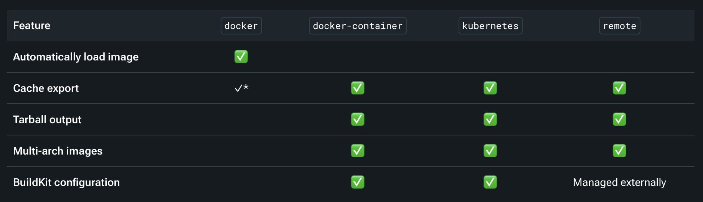
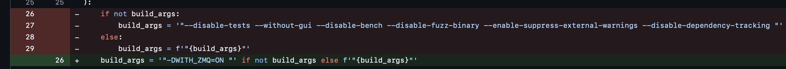

# 👋 Warnet

## Docker - Buildx, BuildKit, builders and bake
BuildX is the CLI tool that you use to run builds, `docker build` is a wrapper around BuildX.
Upon running `docker build`, BuildX interprets the build options and sends a build request to the BuildKit backend, the builder. BuildX can create and manage builders/BuildKit backends.

BuildKit executes build workloads - it resolves the build context (Dockerfile, build arguments, export options, caching options) and executes the build steps. If the build requires resources from the client, such as local files or build secrets, BuildKit requests the resources that it needs from Buildx.

Although `docker build` is an alias for `docker buildx build`, `docker build` always defaults to using the default builder packaged with the Docker Engine whereas `docker buildx build` checks whether you've set a different builder
as the default builder before it sends your build to BuildKit.

Bake allows for build configuration to the defined in a declarative file. It also lets you run multiple builds concurrently with a single invocation.

## Warnet PR reviews
Checkout the relevant forks to test PR branches locally:
- \#669: https://github.com/willcl-ark/warnet/tree/docker-bake
- \#673: https://github.com/pinheadmz/warnet/tree/cmake

### \#669 - Use docker buildx bake to build images
First up, checkout the PR branch and test the build using the new bake.

`docker buildx bake bitcoin-5k-inv`:
```
[+] Building 0.1s (1/1) FINISHED                                                                                                                                                                           docker:default
 => [internal] load local bake definitions                                                                                                                                                                           0.0s
 => => reading docker-bake.hcl 5.35kB / 5.35kB                                                                                                                                                                       0.0s
ERROR: Multi-platform build is not supported for the docker driver.
Switch to a different driver, or turn on the containerd image store, and try again.
Learn more at https://docs.docker.com/go/build-multi-platform/
```
Need to use a different driver to build multi-arch images:


According to the docs, when using the `docker buildx create` command to create a builder, it uses the `docker-container` driver by default. As a `docker-container` driver will allow building of multi-arch images, we'll roll with this.
```bash
docker buildx create --name=warnet-builder
docker buildx ls
# Shows that new builder has been created but is not active
> NAME/NODE             DRIVER/ENDPOINT                   STATUS     BUILDKIT   PLATFORMS
> warnet-builder        docker-container                                        
>   \_ warnet-builder0    \_ unix:///var/run/docker.sock   inactive
> ... snip ...
# Make the new builder the selected builder when invoking builds
docker buildx use warnet-builder
# Make the new builder active - you can only inspect a builder if it's active
docker buildx inspect --bootstrap
```

`docker buildx bake <target>` now works. 

> [!WARNING] The `docker buildx bake bitcoin-5k-inv` took ~1.5 hours to complete on my machine building for multiple platforms `platforms = ["linux/amd64", "linux/armhf"]`! 

Upon further reading (https://docs.docker.com/build/builders/drivers/docker-container/), the above sequence of commands can be replaced with a one-liner:
```bash
docker buildx create --name=warnet-builder --use --bootstrap
```

### \#673 image build: use cmake

Relates to issue [warnet image build still builds with autotools](https://github.com/bitcoin-dev-project/warnet/issues/672).

What's the reason for this? Bitcoin Core migrated its build system from Autotools to CMake in 2024. Bitcoin Core v28 will be the last release that uses Autotools. v29 onwards will use CMake.

Some background material I found useful for context about the switch:
- [Bitcoin core: build: Introduce CMake-based build system PR](https://github.com/bitcoin/bitcoin/pull/30454) - Merged August 28 2024
- [Bitcoin Core's migration to the CMake buildsystem](https://groups.google.com/g/bitcoindev/c/hgKkfQWzrTo) post to Bitcoin Development Mailing List by Cory Fields
- [Autotools vs CMake Feature Parity Table](https://gist.github.com/hebasto/2ef97d3a726bfce08ded9df07f7dab5e) by [hebasto](https://github.com/hebasto) the one responsible for the switch!

> Cory Fields: _"Maintaining Autotools is a huge burden and it's only getting worse over time as it's virtually (though not entirely) unmaintained. As the person who introduced and maintained the current buildsystem and maintained it for years (though others like fanquake and hebasto have been more active for the last few) I'm happy to see it go. She sure was a good ship."_

As Warnet uses Bitcoin Core images that are version <= `v28.X`, there will be a need to support Autotools for these older versions, and CMake for newer versions (>= `v29.X`). So 2 Dockerfiles, one for Autotools/`v28.X` and earler, and one for CMake/`v29.X` and newer.

[danvergara](https://github.com/danvergara) contributed the following branch to add an additional Dockerfile for the CMake build: https://github.com/danvergara/warnet/tree/rewrite-image-build-cmake.

I noticed that there's now a potential issue with the `src/warnet/image_build.py` functionality with the following change being made (in [pinheadmz's original PR](https://github.com/bitcoin-dev-project/warnet/pull/673) in that the style of arguments has changed from e.g. `--disable-tests` style to `-DBUILD_TESTS=OFF` style. This is related to the Autotools -> CMake change (see the [Autotools vs CMake Feature Parity Table](https://gist.github.com/hebasto/2ef97d3a726bfce08ded9df07f7dab5e)).


So the proposed change to `src/warnet/image_build.py` will mean that only CMake style arguments are supported when doing a custom build via `warnet image ...`.

To test this theory out I tested it out locally. Building v28.1 using the previous `build_args` was successful:
```bash
warnet image build --repo=bitcoin/bitcoin --commit-sha=32efe850438ef22e2de39e562af557872a402c31 --registry=localhost --tags=bitcoind:v28.1 --action=load 
```

Switching to the new `build_args`:
```bash
warnet image build --repo=bitcoin/bitcoin --commit-sha=32efe850438ef22e2de39e562af557872a402c31 --registry=localhost --tags=bitcoind:v28.1-cmake --action=load
```

And the build fails:
```
 => ERROR [build 2/2] RUN set -ex     && cd /build     && git clone --depth 1 "https://github.com/bitcoin/bit  28.6s
------                                                                                                               
 > [build 2/2] RUN set -ex     && cd /build     && git clone --depth 1 "https://github.com/bitcoin/bitcoin"     && cd bitcoin     && git fetch --depth 1 origin "32efe850438ef22e2de39e562af557872a402c31"     && git checkout "32efe850438ef22e2de39e562af557872a402c31"     && git apply /tmp/isroutable.patch     && git apply /tmp/addrman.patch     && sed -i s:sys/fcntl.h:fcntl.h: src/compat/compat.h     && ./autogen.sh     && ./configure     LDFLAGS=-L`ls -d /opt/db*`/lib/     CPPFLAGS="-g0 -I`ls -d /opt/db*`/include/ --param ggc-min-expand=1 --param ggc-min-heapsize=32768"     --prefix=/opt/bitcoin     -DWITH_ZMQ=ON      && make -j$(nproc)     && make install     && strip /opt/bitcoin/bin/bitcoin-cli     && strip /opt/bitcoin/bin/bitcoind     && rm -f /opt/bitcoin/lib/libbitcoinconsensus.a     && rm -f /opt/bitcoin/lib/libbitcoinconsensus.so.0.0.0     && rm /opt/bitcoin/bin/bitcoin-tx     && rm /opt/bitcoin/bin/bitcoin-wallet     && rm /opt/bitcoin/bin/bitcoin-util:
0.056 + cd /build
0.056 + git clone --depth 1 https://github.com/bitcoin/bitcoin
0.066 Cloning into 'bitcoin'...
4.343 + cd bitcoin
4.343 + git fetch --depth 1 origin 32efe850438ef22e2de39e562af557872a402c31
7.365 From https://github.com/bitcoin/bitcoin
7.365  * branch            32efe850438ef22e2de39e562af557872a402c31 -> FETCH_HEAD
7.380 + git checkout 32efe850438ef22e2de39e562af557872a402c31
7.671 Note: switching to '32efe850438ef22e2de39e562af557872a402c31'.
7.671 
7.671 You are in 'detached HEAD' state. You can look around, make experimental
7.671 changes and commit them, and you can discard any commits you make in this
7.671 state without impacting any branches by switching back to a branch.
7.671 
7.671 If you want to create a new branch to retain commits you create, you may
7.671 do so (now or later) by using -c with the switch command. Example:
7.671 
7.671   git switch -c <new-branch-name>
7.671 
7.671 Or undo this operation with:
7.671 
7.671   git switch -
7.671 
7.671 Turn off this advice by setting config variable advice.detachedHead to false
7.671 
7.672 HEAD is now at 32efe85 Merge bitcoin/bitcoin#31594: [28.x] 28.1 backports and final changes
7.674 + git apply /tmp/isroutable.patch
7.688 + git apply /tmp/addrman.patch
7.702 + sed -i s:sys/fcntl.h:fcntl.h: src/compat/compat.h
7.711 + ./autogen.sh
15.21 libtoolize: putting auxiliary files in AC_CONFIG_AUX_DIR, 'build-aux'.
15.21 libtoolize: copying file 'build-aux/ltmain.sh'
15.34 libtoolize: putting macros in AC_CONFIG_MACRO_DIRS, 'build-aux/m4'.
15.34 libtoolize: copying file 'build-aux/m4/libtool.m4'
15.45 libtoolize: copying file 'build-aux/m4/ltoptions.m4'
15.57 libtoolize: copying file 'build-aux/m4/ltsugar.m4'
15.70 libtoolize: copying file 'build-aux/m4/ltversion.m4'
15.82 libtoolize: copying file 'build-aux/m4/lt~obsolete.m4'
18.69 configure.ac:39: installing 'build-aux/ar-lib'
18.70 configure.ac:37: installing 'build-aux/compile'
18.70 configure.ac:24: installing 'build-aux/config.guess'
18.71 configure.ac:24: installing 'build-aux/config.sub'
18.71 configure.ac:27: installing 'build-aux/install-sh'
18.72 configure.ac:27: installing 'build-aux/missing'
18.75 Makefile.am: installing 'build-aux/depcomp'
18.79 parallel-tests: installing 'build-aux/test-driver'
19.12 libtoolize: putting auxiliary files in AC_CONFIG_AUX_DIR, 'build-aux'.
19.12 libtoolize: copying file 'build-aux/ltmain.sh'
19.25 libtoolize: putting macros in AC_CONFIG_MACRO_DIRS, 'build-aux/m4'.
19.25 libtoolize: copying file 'build-aux/m4/libtool.m4'
19.51 libtoolize: copying file 'build-aux/m4/ltoptions.m4'
19.79 libtoolize: copying file 'build-aux/m4/ltsugar.m4'
20.06 libtoolize: copying file 'build-aux/m4/ltversion.m4'
20.33 libtoolize: copying file 'build-aux/m4/lt~obsolete.m4'
25.36 configure.ac:114: installing 'build-aux/compile'
25.36 configure.ac:51: installing 'build-aux/config.guess'
25.37 configure.ac:51: installing 'build-aux/config.sub'
25.37 configure.ac:58: installing 'build-aux/install-sh'
25.38 configure.ac:58: installing 'build-aux/missing'
25.61 src/Makefile.am: installing 'build-aux/depcomp'
28.19 parallel-tests: installing 'build-aux/test-driver'
28.34 + ls -d '/opt/db*'
28.34 ls: /opt/db*: No such file or directory
28.34 + ls -d '/opt/db*'
28.35 ls: /opt/db*: No such file or directory
28.35 + ./configure 'LDFLAGS=-L/lib/' 'CPPFLAGS=-g0 -I/include/ --param ggc-min-expand=1 --param ggc-min-heapsize=32768' '--prefix=/opt/bitcoin' '-DWITH_ZMQ=ON'
28.48 configure: error: unrecognized option: '-DWITH_ZMQ=ON'
28.48 Try './configure --help' for more information
------
Dockerfile.pre-v29:34
--------------------
  33 |     
  34 | >>> RUN set -ex \
  35 | >>>     && cd /build \
  36 | >>>     && git clone --depth 1 "https://github.com/${REPO}" \
  37 | >>>     && cd bitcoin \
  38 | >>>     && git fetch --depth 1 origin "$COMMIT_SHA" \
  39 | >>>     && git checkout "$COMMIT_SHA" \
  40 | >>>     && git apply /tmp/isroutable.patch \
  41 | >>>     && git apply /tmp/addrman.patch \
  42 | >>>     && sed -i s:sys/fcntl.h:fcntl.h: src/compat/compat.h \
  43 | >>>     && ./autogen.sh \
  44 | >>>     && ./configure \
  45 | >>>     LDFLAGS=-L`ls -d /opt/db*`/lib/ \
  46 | >>>     CPPFLAGS="-g0 -I`ls -d /opt/db*`/include/ --param ggc-min-expand=1 --param ggc-min-heapsize=32768" \
  47 | >>>     --prefix=${BITCOIN_PREFIX} \
  48 | >>>     ${BUILD_ARGS} \
  49 | >>>     && make -j$(nproc) \
  50 | >>>     && make install \
  51 | >>>     && strip ${BITCOIN_PREFIX}/bin/bitcoin-cli \
  52 | >>>     && strip ${BITCOIN_PREFIX}/bin/bitcoind \
  53 | >>>     && rm -f ${BITCOIN_PREFIX}/lib/libbitcoinconsensus.a \
  54 | >>>     && rm -f ${BITCOIN_PREFIX}/lib/libbitcoinconsensus.so.0.0.0 \
  55 | >>>     && rm ${BITCOIN_PREFIX}/bin/bitcoin-tx \
  56 | >>>     && rm ${BITCOIN_PREFIX}/bin/bitcoin-wallet \
  57 | >>>     && rm ${BITCOIN_PREFIX}/bin/bitcoin-util
  58 |     
--------------------
ERROR: failed to solve: process "/bin/sh -c set -ex     && cd /build     && git clone --depth 1 \"https://github.com/${REPO}\"     && cd bitcoin     && git fetch --depth 1 origin \"$COMMIT_SHA\"     && git checkout \"$COMMIT_SHA\"     && git apply /tmp/isroutable.patch     && git apply /tmp/addrman.patch     && sed -i s:sys/fcntl.h:fcntl.h: src/compat/compat.h     && ./autogen.sh     && ./configure     LDFLAGS=-L`ls -d /opt/db*`/lib/     CPPFLAGS=\"-g0 -I`ls -d /opt/db*`/include/ --param ggc-min-expand=1 --param ggc-min-heapsize=32768\"     --prefix=${BITCOIN_PREFIX}     ${BUILD_ARGS}     && make -j$(nproc)     && make install     && strip ${BITCOIN_PREFIX}/bin/bitcoin-cli     && strip ${BITCOIN_PREFIX}/bin/bitcoind     && rm -f ${BITCOIN_PREFIX}/lib/libbitcoinconsensus.a     && rm -f ${BITCOIN_PREFIX}/lib/libbitcoinconsensus.so.0.0.0     && rm ${BITCOIN_PREFIX}/bin/bitcoin-tx     && rm ${BITCOIN_PREFIX}/bin/bitcoin-wallet     && rm ${BITCOIN_PREFIX}/bin/bitcoin-util" did not complete successfully: exit code: 1
```

I briefly raise this in [a comment](https://github.com/bitcoin-dev-project/warnet/pull/673#discussion_r1984589951), and [ask the question](https://github.com/bitcoin-dev-project/warnet/pull/673#issuecomment-2705745901):
> @pinheadmz, @willcl-ark do you wish for users to be able to use warnet image build for arbitrary Bitcoin Core commits (pre the CMake switchover of bitcoin/bitcoin#30454)?
>
>If so, we'll need to support the 2 different styles of build_args (and reference the different Dockerfiles) to do so.
>
>https://gist.github.com/hebasto/2ef97d3a726bfce08ded9df07f7dab5e
