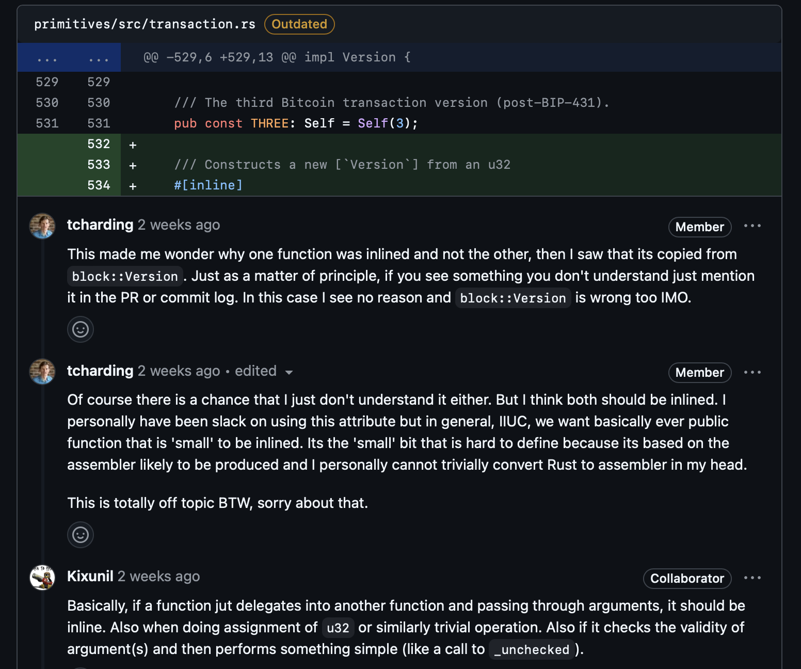
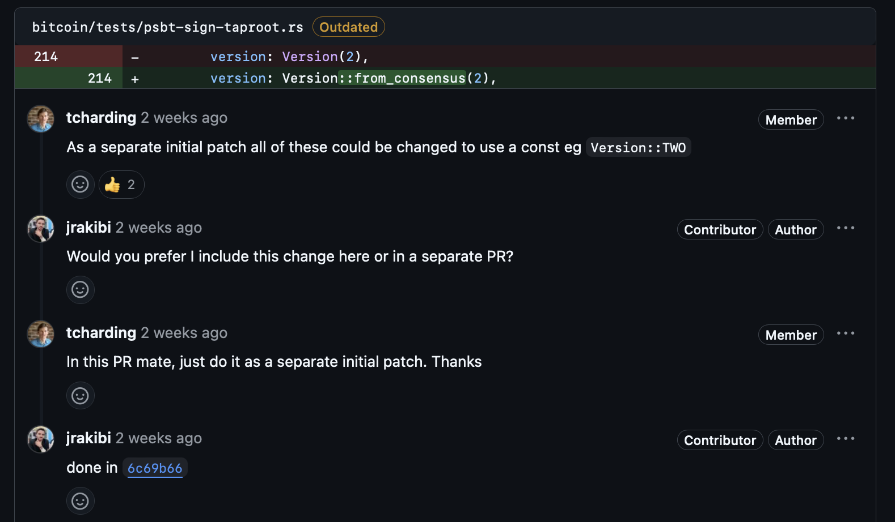

# 👋 rust-bitcoin

This is collection of crates constituting the `rust-bitcoin` ecosystem. As such this is a pretty big repo that has a lot of activity. I'm going to initially focus on getting an overview of the structure and do the basics of building, running the tests etc rather than, for example, looking at issues and focusing on any narrow area.

## Prep
- Read the main `README.md`
- Read the main `CONTRIBUTING.md`
- Run the provided `just` commands to build, test, etc
- Read the `README.md` of and poke around each of the directories/sub-crates:
  - `addresses` - "Empty crate to reserve the name (bitcoin-addresses) on crates.io".. wild!!
  - `base58` - on crates.io as `base58`.
  - `bitcoin` - this is the main crate.
  - `chacha20_poly1305` - on crates.io as `chacha20-poly1305`.
  - `fuzz` - all about fuzzing, not a crate.
  - `hashes` - on crates.io as `bitcoin_hashes`.
  - `internals` - on crates.io as `bitcoin-internals`. Only really meant to be used *internally* by the crates in the `rust-bitcoin` ecosystem.
  - `io`- on crates.io as `bitcoin-io`, this is so `rust-bitcoin` can be used to support `no-std` applications.
  - `primitives` - on crates.io as `bitcoin-primitives`. 
  - `units` - on crates.io as `bitcoin-units`. Seems this is a bit of a problem child recently, e.g. https://github.com/rust-bitcoin/rust-bitcoin/issues/4218


### Just
The project recommends to use [just](https://just.systems/man/en/introduction.html): "a handy way to save and run project-specific command". Never heard of this before, but seems like a good alternative to using Makefile which is often what I lean on. There's a `justfile` in the project repo so so we're good to go.

### Mutation testing
In the `README.md` it mentions that the project uses [mutagen](https://github.com/llogiq/mutagen). So I follow the instructions to install and run it but encounter:

```
Error!
file `target/mutagen/mutations` is not found
maybe there are no mutations defined or the attribute `#[mutate]` is not enabled
```

Ok, so mutagen requires the `#[mutate]` attribute to be enabled. Buts there's no `#[mutate]` in the codebase! Checking the repo on GitHub, I see there's an issue [Mutation testing improvements (get rid of mutagen)](https://github.com/rust-bitcoin/rust-bitcoin/issues/2829). Sure enough, mutagen was removed earlier this year in the [Remove mutagen #3931](https://github.com/rust-bitcoin/rust-bitcoin/pull/3931) PR. So it seems the `README.md` is outdated wrt mutation testing and needs to be updated. Opened a PR to fix this: https://github.com/rust-bitcoin/rust-bitcoin/pull/4228

Running the mutation testing also revealed a few issues:
```
cargo mutants --in-place --no-shuffle
Found 774 mutants to test
ok       Unmutated baseline in 4.2s build + 17.2s test
 INFO Auto-set test timeout to 1m 27s
MISSED   units/src/timestamp.rs:38:40: replace Timestamp::to_u32 -> u32 with 0 in 0.9s build + 9.5s test
MISSED   units/src/timestamp.rs:38:40: replace Timestamp::to_u32 -> u32 with 1 in 0.8s build + 6.2s test
MISSED   units/src/timestamp.rs:48:37: replace <impl From for u32>::from -> Self with Default::default() in 0.9s build + 6.7s test
774 mutants tested in 15m 34s: 3 missed, 599 caught, 172 unviable
error: Recipe `cargo-mutants-run` failed on line 67 with exit code 2
```

These mutants have already been found by CI and an issue has been (automatically) opened: https://github.com/rust-bitcoin/rust-bitcoin/issues/4225

### Kani
Pretty much each project I look at, there is some new tool or technique I've never heard of. This time it's [Kani](https://github.com/model-checking/kani).
It's a "model checker" for Rust code that verifies correctness via symbolic execution and automated theorem proving to exhaustively check all possible program states for a given code path. For example, instead of using specific input values like `5` symbolic values like `x` are used to build mathematical formulas that represent the programs behaviour with respect to `x`.

Kani is only used in a few places in the codebase, perhaps most notably in the `units/src/amount/verification.rs` file, where it's used to formally verify arithmetic operations on `Amount` types. For example, proving that constructing two `Amount`s and adding or subtracting them (e.g. `Amount(a) + Amount(b)`) gives the same result as constructing an `Amount` from an arithmetic addition/subtraction (e.g. `Amount(a + b)`).

### Fuzzing
Welp, send help...!
```
error: failed to run custom build command for `honggfuzz v0.5.56`

Caused by:
  process didn't exit successfully: `/Users/<user>/dev/bitcoin/rust-bitcoin/fuzz/hfuzz_target/release/build/honggfuzz-26e2f2631dd309c6/build-script-build` (exit status: 101)
  --- stderr
  Makefile:117: *** Unsupported MAC OS X version.  Stop.

  thread 'main' panicked at /Users/<user>/.cargo/registry/src/index.crates.io-1949cf8c6b5b557f/honggfuzz-0.5.56/build.rs:44:5:
  assertion failed: status.success()
  note: run with `RUST_BACKTRACE=1` environment variable to display a backtrace
warning: build failed, waiting for other jobs to finish...
```

Left this in the to-follow-up basket for now...

### Running benchmarks
The project uses [`Bencher`](https://doc.rust-lang.org/test/bench/struct.Bencher.html#) to run benchmarks on performance critical code. 
It allows for running pieces of code repeatedly via a call to iter so that performance characteristics can be measured. They are run with `RUSTFLAGS='--cfg=bench' cargo +nightly bench`. Here's some sample output from a benchmarks run that reports the throughput of the `chacha20` benchmarks, contributed by ₿OSS 2025 participant [JeremiahR](https://github.com/JeremiahR)!!
```
test benches::chacha20_10  ... bench:         205.27 ns/iter (+/- 4.83) = 48 MB/s
test benches::chacha20_1k  ... bench:       3,218.05 ns/iter (+/- 74.16) = 318 MB/s
test benches::chacha20_64k ... bench:     207,927.99 ns/iter (+/- 4,714.25) = 315 MB/s
```

## rust-bitcoin PR review
The PR has been merged already so we can just examine the changes in the
main `rust-bitcoin` repo (I was cloning forks & checking out branches for other PR reviews).

### \#4099 - Make transaction::Version field private
https://github.com/rust-bitcoin/rust-bitcoin/pull/4099

The PR was in response to [Confusion around strandardness of `transaction::Version`](https://github.com/rust-bitcoin/rust-bitcoin/issues/4041). Specifically
> "we have a public Version field, allowing to write non-standard version but at the same time we have non_standard method." 

The changes in the PR made the underlying `u32` externally accessible to set via the `maybe_non_standard` constructor and to get via the `to_u32` method. This made the `transaction::Version` struct have a public interface similar to other similar structures such as `block::Version` (`primitives/src/block.rs`) and `Timestamp` (`units/src/timestamp.rs`), for example.

I found reading through the review comments and seeing how the PR evolved to be informative, such as:

When should a pub function be inlined?


How logical separately but still relevant to the PR changes should be separated into different patches/commits (for easier review)


I also didn't realise until looking at this PR that any and all commits, even if "overwritten" by a force push, are maintained and viewable in the GitHub UI. So force-pushing will certainly clean-up the commit history, but any intermediate work is still there for all to seen (force-pushing won't eliminate your embarrassing mistakes🙃).
